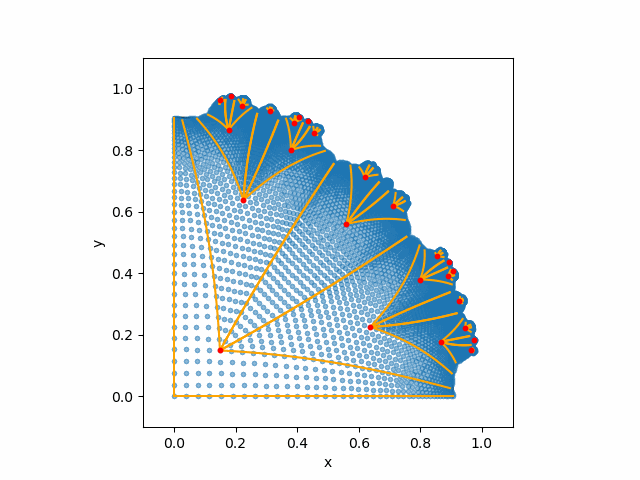

# Creating K-Surfaces with Branch Points

  

Create and visualize discrete analogues of surfaces with constant negative Gaussian curvature! The algorithms in this repo are based on the papers 

> **"Discrete Surfaces with Constant Negative Gaussian Curvature and the Hirota Equation"**  
> Alexander Bobenko and Ulrich Pinkall, *J. Differential Geometry* 43 (1996), 527–611.
> Available: https://page.math.tu-berlin.de/~bobenko/papers/1996_Bob_Pin_K.pdf

and

> **"Distributed Branch Points and the Shape of Elastic Surfaces with Constant Negative Curvature"**
> Toby L. Shearman and Shankar C. Venkataramani, *Journal of Nonlinear Science*, vol. 31, no. 1, p. 13, Jan 2021.
> Available: https://doi.org/10.1007/s00332-020-09657-2

## Smooth Theory

Why do certain strange, curly, crenelated shapes appear in nature? We hypothesize that surfaces in nature are approximately minimizing elastic energy
and model this via an energy functional

$$ \mathcal{E}_2[r] = \begin{cases}
    \int_{\Omega} (\kappa_1^2 + \kappa_2^2) &nbsp; dA \text{ if } r\in W^{2,2}, &nbsp; dr\cdot dr=g\\
    + \infty, \text{ else.}
    \end{cases} 
$$

where $r:\Omega \to \mathbb{R}^3$ is a surface, $\kappa_1$, $\kappa_2$ are the principal curvatures, and $g$ is the target metric. In particular, curly surfaces have a boundary that is exponentially increasing with their radius. Hence a natural choice for $g$ is a hyperbolic metric (i.e a metric that yields negative Gaussian curvature $K<0$). We choose to study surfaces with constant negative Gaussian curvature $K=-1$. It appears that minimizers of this functional are non-smooth ($C^{1,1}$ or even less regular)! Therefore the normal Euler-Lagrange approach is insufficient. This motivates the...

## Discrete Differential Geometric Approach

Let us call a discrete approximation of a surface with constant negative Gaussian curvature a K-surface. We will also assume all faces of a K-surface are quadrilaterals. As mentioned in the paper by Bobenko and Pinkall, a natural discretization for K-surfaces are the conditions:

1. All immediate neighbors of a vertex lie in the same plane.
2. Opposite sides of a quadrilateral have the same length.

Building a K-surface from just these two conditions turns out to be surprisingly difficult (but stay tuned for a future project). It turns out that a special parameterization (asymptotic coordinates) for the smooth version of a K-surface forms what is known as a Chebyshev net. For us this just means we are able to take a metric of the form 

$$
ds^2 = du^2 + 2 \cos \rho(u,v) du dv + dv^2
$$

which, if you squint, looks a bit like the law of cosines for a rhombus with an interior angle $\rho$ and side lengths $du$ and $dv$! Indeed, $\rho$ is the angle between coordinate lines in the smooth case. In our discrete world, we want to approximate our surface (and thus this metric) by building a Chebyshev net in a space where K=-1. The Poincaré disk model of the hyperbolic plane is one such space. It is defined on the domain 

$$
D = \{(x,y)\in \mathbb{R}^2: x^2 + y^2 <1 \}
$$

with the metric

$$
ds_P^2 = \left(\frac{4}{(1-x^2-y^2)^2} \right)(dx^2 +dy^2).
$$

To build a discrete Chebyshev net, we construct a tiling of rhombi on the Poincaré disk. Using some differential geometry magic we then map this to a Chebyshev net on the sphere. We then can use even more dark geometry secrets to derive

$$
r_u = N_u \times N \text{ and } r_v = -N_v \times N
$$

where $N$ is the normal for our surface defined by $r$. Taking a first order discretization of these formulas then allows us to construct a surface from the Chebyshev net on the sphere! Due to some clever integrability considerations this will create a K-surface. At a high level $\rho$ must satisfy the Sine-Gordon equation $\rho_{uv} = \sin \rho$ and any solution to the Sine-Gordon equation defines a surface with $K=-1$! All we have essentially done with this algorithm is create an approximation of a solution to the Sine-Gordon equation that critically satisfies discrete analogues of smooth conditions (this is the true magic of the DDG). 

## File Structure

| File | Description |
|---|---|
| `Pdisc_SG_classes.py` | Core implementation: all grid and tree classes for the three-stage pipeline |
| `Pdisc_SG_math.py` | Mathematical utilities: Möbius transformations, Rodrigues rotation, Householder reflection |
| `Pdisc_SG_vis.py` | Visualization: 2D Poincaré disk plots (matplotlib) and 3D surface/sphere plots (pyvista) |
| `gif_maker.py` | Helper script for assembling figure sequences into animated GIFs |
| `numerical_explorations/` | Parameter sweep scripts for exploring solution families |

## Dependencies

- [NumPy](https://numpy.org/)
- [Matplotlib](https://matplotlib.org/)
- [PyVista](https://pyvista.org/)
- [imageio](https://imageio.readthedocs.io/)

## Summary

Make cool shapes and rock out! 
